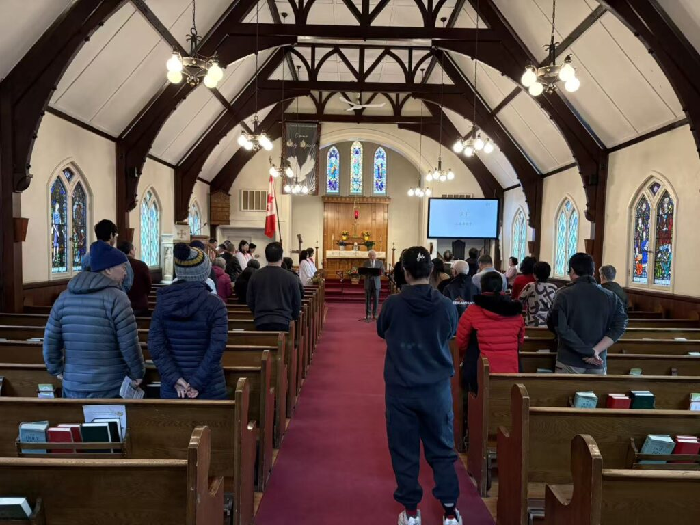
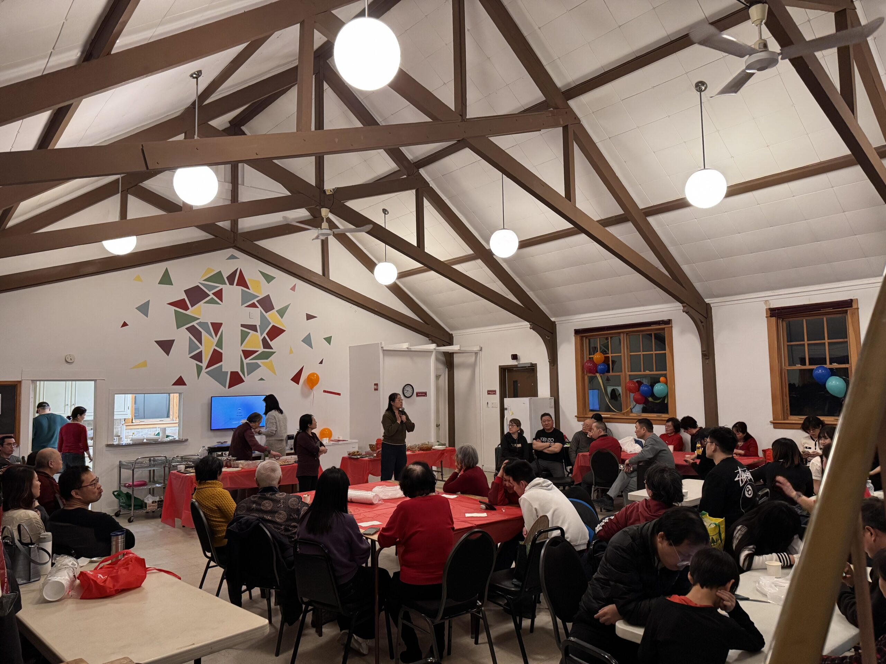
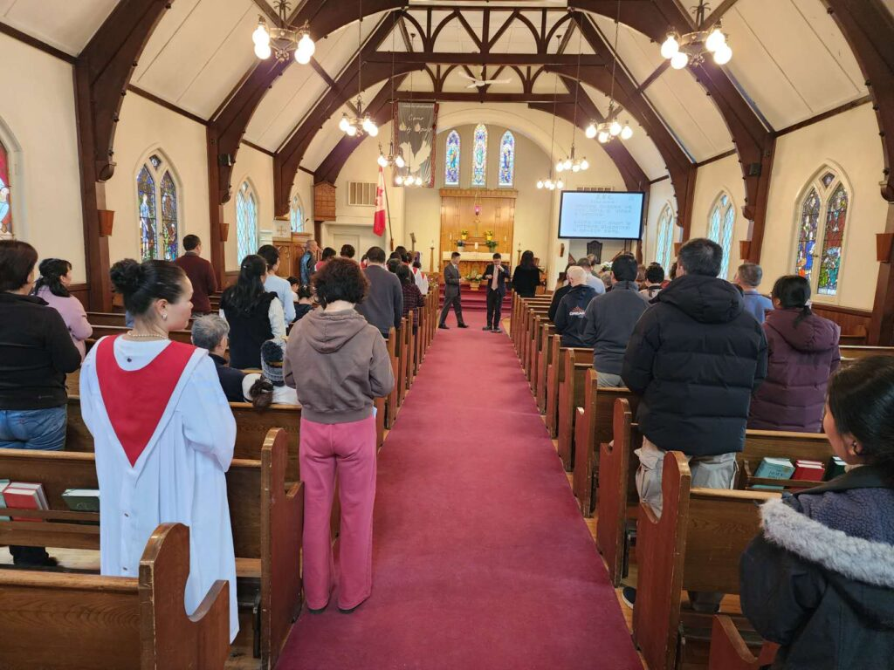

+++
title = "Sunday Gatherings"
date = "2026-05-11T20:17:46"
translationKey = "meeting"
aliases = ["/en/meeting/"]
hideTitle = false
+++

<section class="meeting-wrap">
  <section class="meeting-intro">
    
WORSHIP &amp; FELLOWSHIP · SCHEDULE

    <h2>Join us for worship, prayer, and Christian community</h2>
    
Whether you are visiting for the first time or already walking with our church family, you are warmly welcome to join Sunday worship, Sunday school, prayer gatherings, and fellowship throughout the week.

  </section>

  <section class="meeting-highlights">
    <article class="meeting-highlight">
      
Sunday Worship

      <h3>Every Sunday at 2:00 PM</h3>
      
Our main service meets in person, with online access available for those joining remotely.

    </article>
    <article class="meeting-highlight">
      
Sunday School

      <h3>For adults and children</h3>
      
Adult Sunday School begins at 4:00 PM, while Children's Sunday School runs alongside the Sunday service.

    </article>
    <article class="meeting-highlight">
      
Prayer &amp; Fellowship

      <h3>Stay connected through the week</h3>
      
Prayer meeting, seeker class, growth class, and fellowship gatherings help us keep growing together in faith and care.

    </article>
  </section>

  <section class="meeting-section">
    

      
SCHEDULE · WEEKLY GATHERINGS

      <h3>Meeting times</h3>
    

    

      <table class="meeting-table">
        <thead>
          <tr>
            <th>Gathering</th>
            <th>Time</th>
            <th>Location / Zoom</th>
            <th>Password</th>
          </tr>
        </thead>
        <tbody>
          <tr>
            <td>Sunday Worship</td>
            <td>Sunday 2:00 PM</td>
            <td>In-person + Zoom 891 0689 8173</td>
            <td>2026</td>
          </tr>
          <tr>
            <td>Youth Fellowship Band</td>
            <td>Sunday 10:30 AM</td>
            <td>In-person</td>
            <td>-</td>
          </tr>
          <tr>
            <td>Adult Sunday School</td>
            <td>Sunday 4:00 PM</td>
            <td>In-person</td>
            <td>-</td>
          </tr>
          <tr>
            <td>Children's Sunday School</td>
            <td>Sunday 2:00 PM</td>
            <td>In-person</td>
            <td>-</td>
          </tr>
          <tr>
            <td>Evergreen Fellowship</td>
            <td>Wednesday 12:30 PM</td>
            <td>In-person</td>
            <td>-</td>
          </tr>
          <tr>
            <td>Prayer Meeting</td>
            <td>Wednesday 8:00 PM</td>
            <td>Zoom 891 0689 8173</td>
            <td>2026</td>
          </tr>
          <tr>
            <td>Explore Christianity - New Life Class</td>
            <td>Thursday 8:00 PM</td>
            <td>Zoom 891 0689 8173</td>
            <td>2026</td>
          </tr>
          <tr>
            <td>New Life Growth Class</td>
            <td>Friday 8:00 PM</td>
            <td>Zoom 839 0415 4993</td>
            <td>2026</td>
          </tr>
        </tbody>
      </table>
    

  </section>

  <section class="meeting-section">
    

      
COMMUNITY · GALLERY

      <h3>Life together in worship and fellowship</h3>
    

    <figure class="wp-block-gallery has-nested-images columns-default is-cropped meeting-gallery-original">
      <figure class="is-style-creative-1-a wp-block-image size-large">
        
      </figure>
      <figure class="is-style-creative-1-b wp-block-image size-large">
        
      </figure>
      <figure class="is-style-creative-1-d wp-block-image size-large">
        
      </figure>
    </figure>
  </section>
</section>
